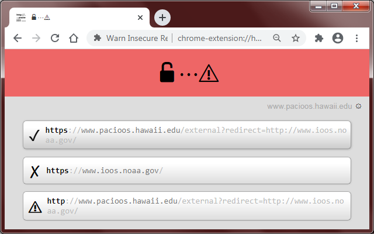

# Warn Insecure Redirection

## Overview:

If you visit a link that appears to simply be a redirection link and that link is not loaded over HTTPS, it will expose the redirection link to potential snoopers.

For example, if you visit:

http://www.google.com/url?url=https://paypal.me/ashleymadison/30USD&rct=j&q=

Notice the HTTP in "http://www.google.com" means it is insecure.

In this example, since google.com is NOT loaded over HTTPS, everyone on the Internet will know that you intend to visit the Paypal website to send money to Ashley Madison. Even though the Paypal website will be loaded over HTTPS, your intention will already be exposed by visiting google.com over an insecure connection.

This extension will catch these potential problems and give you the option to:

1. Try loading google.com over HTTPS
2. Visit Paypal directly over HTTPS
3. Continue with the insecure link

This extension will also "ping" the root page ("[/](https://www.google.com/)") at google.com over HTTPS to see if it is accessible and if so, will automatically navigate to the google.com page over HTTPS.

It will also "ping" the root page at paypal.me over HTTPS to determine if it is accessible and will add a tick or cross, so that you can decide whether you want to go directly to it.

## Screenshot:

